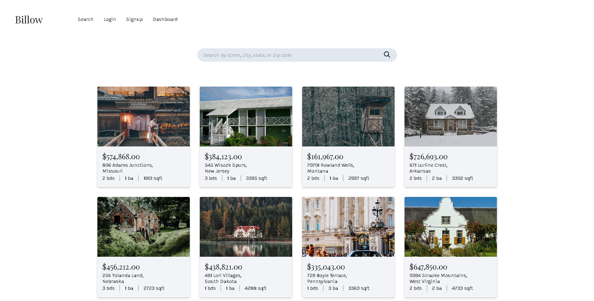
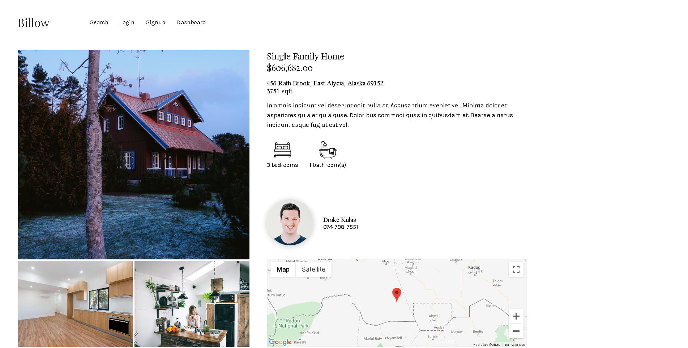

# Billow Home Realty App (Client Side)

[Link](https://alexcurran-billow.netlify.com/)

## Features:

* Utilizes Vue.js framework

* View and component code structure

* Fetch API used to send requests to custom back-end API for house data (GET, POST, PATCH, & DELETE)

* Account creation for users/admins, login, & logout with JWT for auth

* Pagination for home search view

* JS Lightbox gallery for Home view

* User/admin unique dashboards

* Logged in users may save favorite homes during searches

* User dashboard has the ability to view and delete favorite homes

* Admin dashboard has selective components that show on tab click

* Admins may create new home listings, update them, or delete them

* Google Maps API implemented with custom markers to show lat/lon location of individual homes

* Custom modern CSS layout via Grid and Flexbox used throughout 